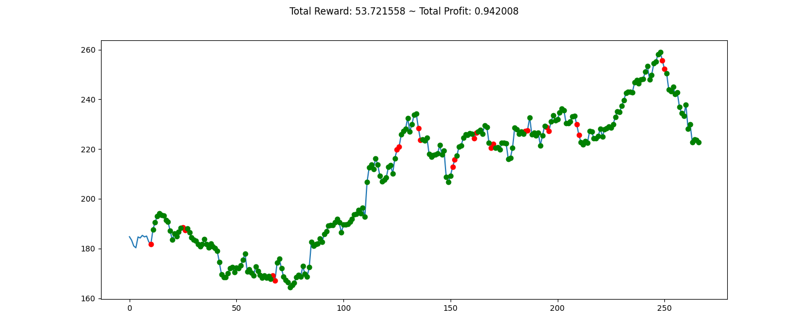

# Re-enforcement learning-based trading bot
## 🎯 Project Overview:
This project focuses on developing a reinforcement learning (RL)-based stock trading bot using `Gym-AnyTrading`, `Stable-Baselines3`, and `Yahoo Finance` data. The model is trained using `Proximal Policy Optimization (PPO)` to maximize long-term profits by making dynamic `buy` and `sell` decisions.

## ✏️ Define the Reinforcement Learning Problem:
### State (Observation Space)
- Current stock price.
- Portfolio state (cash, shares held, profit/loss).
- Technical indicators (Moving Averages, RSI, MACD).

### Action Space
- 0: `Sell`
- 1: `Buy`
  
### Reward Function 
Profit/loss per trade with penalties for excessive trades.

## ⚙️ Technology:
### Data Collection
- Data Source: Yahoo Finance (`yfinance` API).
- Ticker Used: AAPL (Apple Inc.).
- Timeframe: 1 Year (January 2024 - January 2025).
- Features Used: `Open`, `High`, `Low`, `Close`, `Volume`.

### Environment Setup
`GymAnyTrading`

### Trading Actions 
Even though trading algorithms use numerous actions such as `Buy`, `Sell`, `Hold`, `Enter`, etc, deciding whether to hold, enter, or existing stock is a statistical decision depending on many parameters such as your budget, the stock you trade, your money distribution policy in multiple markets, etc. Thus, it's a massive burden for an RL agent to consider all these parameters, and it may take years to develop such an agent! 

🌟 **Only `Sell`= 0 and `Buy`= 1 actions are adequate to train an agent just as well.**

### Trading Positions:
_refers to the commitment a trader or investor has in a particular asset, such as stocks, forex, commodities, or cryptocurrencies._
-  Long Position: Buying an asset with the expectation that its price will rise
- Short Position: Selling an asset (often borrowed) with the expectation that its price will fall

🌟 **Only use `Short`= 0 and `Long`= 1 positions**

### Trading Environments
- `TradingEnv` is an abstract class that inherits `gym.Env`. This class aims to provide a general-purpose environment for all kinds of trading markets.
- `StocksEnv`: a concrete class that inherits `TradingEnv` and implements its abstract methods.

### Model Training
- Algorithm: `Proximal Policy Optimization (PPO)`
- Hyperparameters:
```
gamma = 0.99 (reward discount factor)
learning_rate = 0.0003
batch_size = 64
policy = MlpPolicy
Training Steps: 100,000 timesteps
```

## 🚀 Running TradingBot:
To run TradingBot on the file main.py 

```sh
python3 main.py
```

## 👀 Output:
### Training Result


## 📝 Analysis:
### Backtest Metrics

| **Metric**              | **Value** | **Interpretation**                                |
|--------------------------|-----------|---------------------------------------------------|
| Cumulative Return        | -4.17%    | Model lost 4.17% of capital over the testing period. |
| CAGR (Annualized Return) | -2.85%    | Losing money at 2.85% annually.                  |
| Sharpe Ratio             | -0.07     | Negative, indicating poor risk-adjusted returns. |
| Sortino Ratio            | -0.13     | High downside volatility relative to gains.      |
| Max Drawdown             | -19.01%   | Worst loss from peak before recovering.          |
| Time in Market           | 7.0%      | Model trades infrequently.                       |
| Profit Factor            | 0.95      | Below 1, indicating losing trades exceed winning ones. |
| Recovery Factor          | 0.09      | Long recovery time from drawdowns.               |
| Average Drawdown         | -13.66%   | Frequent losses of 13.66%, making recovery difficult. |

## 💡 Conclusions:
### Key Findings

- The RL model is not currently profitable (-4.17% return).
- Too cautious: Only trades 7% of the time, missing potential gains.
Poor risk-adjusted performance (Negative Sharpe, Sortino).

### Future Directions
- Increase Trading Frequency: Adjust the reward function to encourage more trades.
- Optimize Stop-Loss: Experiment with -3% to -7% stop-loss levels.
- Feature Engineering:
Include Relative strength index (`RSI`), `Bollinger Bands`, and Moving average convergence/divergence (`MACD`) as input features.
- Hyperparameter Tuning:
```
Reduce gamma (0.95) to favor short-term rewards.
Lower learning_rate (0.0001) for more stable learning.
Increase batch_size (128) to reduce variance.
```


## ⚖️ License:
Apache License 2.0
